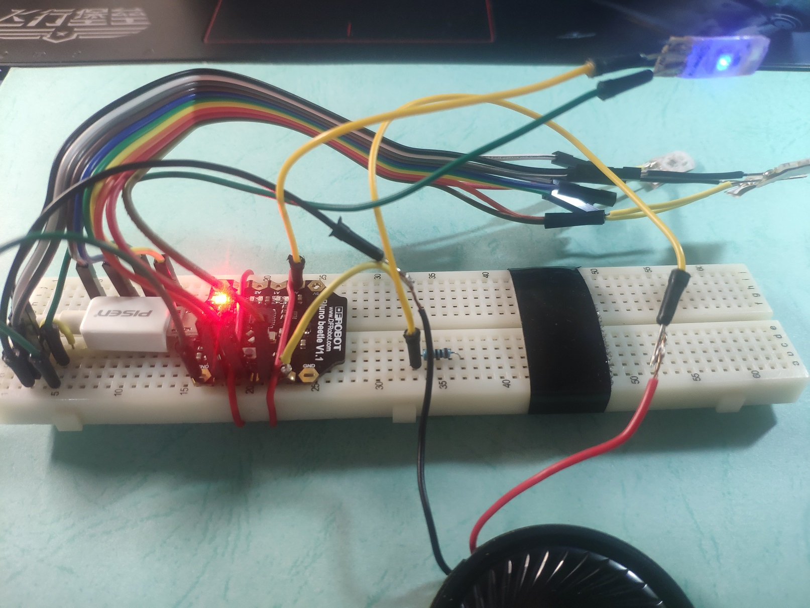
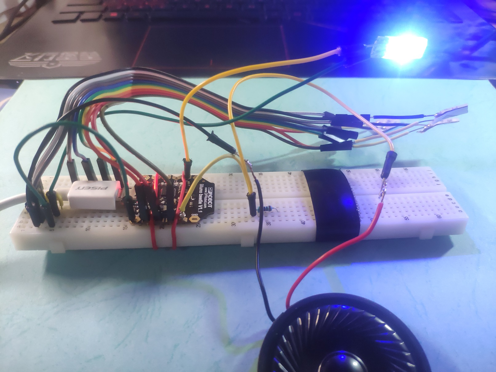
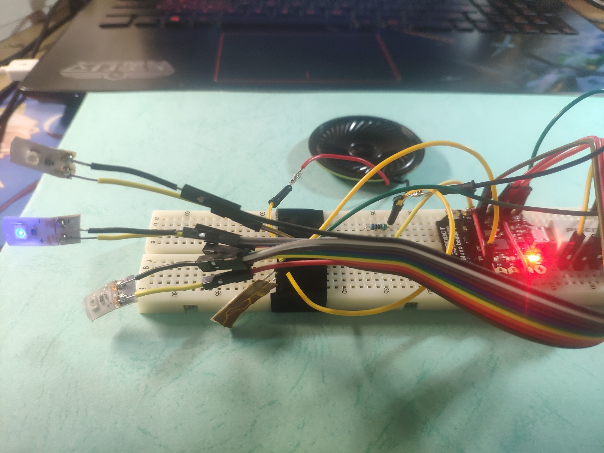
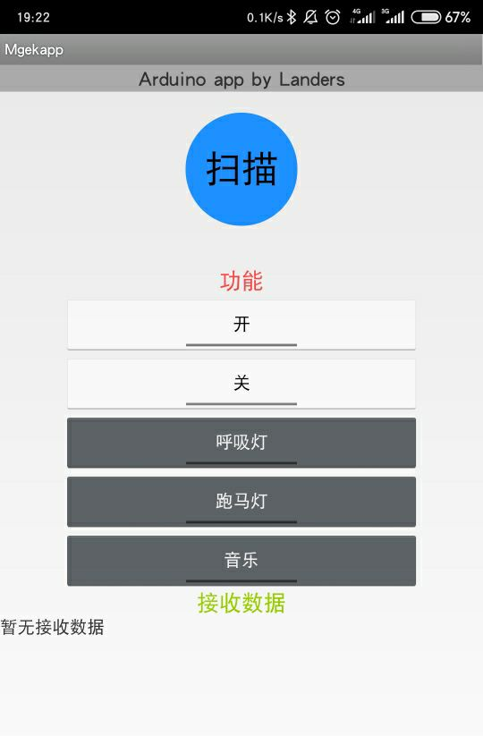
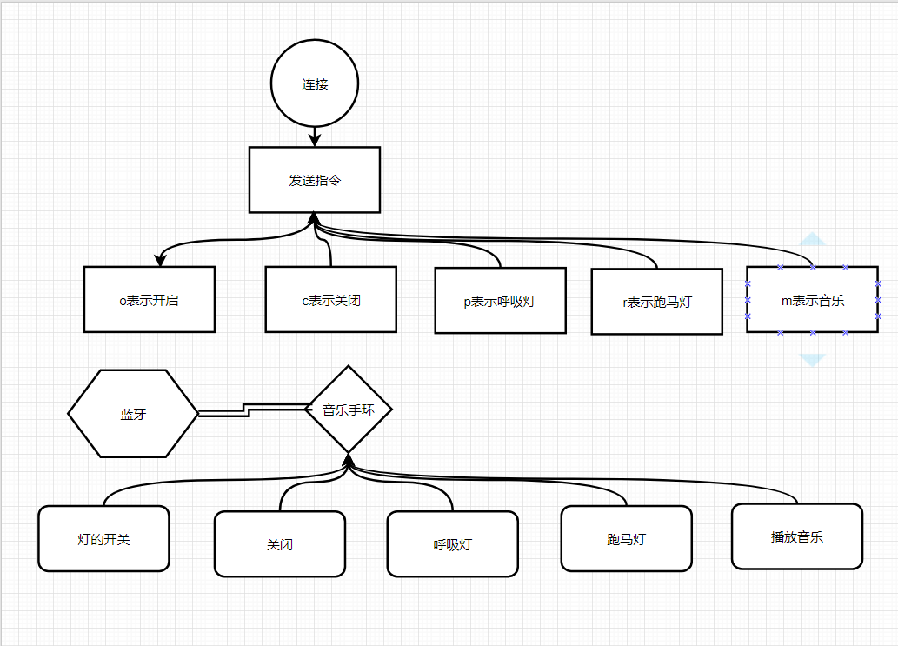

# arduinomusicLED
arduino实现的蓝牙控制的音乐台灯


#### 项目介绍

[Mgekapp](<http://m.landers1037.top/mgekapp.html>)

#### 项目文档

[前往](http://landers1037.top/doc/arduino.html)

#### 实现功能

1. 使用蓝牙远程操控开发板
2. 定制发送指令，实现跑马灯，呼吸灯，播放音乐，开关的功能

#### 演示

开关灯



呼吸灯



跑马灯



#### Android程序



#### 原理图



##### 具体实现

定制发送一个字符代表特殊的指令

- `o`表示开
- `c`表示关
- `p`表示呼吸灯
- `r`表示跑马灯
- `m`表示播放音乐

```java
public class MainActivity  extends BlunoLibrary {
	private Button buttonScan;
	private Button open; //开关灯
	private Button close;
	private Button pwm; //呼吸
	private Button run; //跑马灯
	private Button music; //音乐
	private Button buttonSerialSend;
	private EditText serialSendText;
	private TextView serialReceivedText;
	
	@Override
	protected void onCreate(Bundle savedInstanceState) {
		super.onCreate(savedInstanceState);
		setContentView(R.layout.activity_main);
        onCreateProcess();														//onCreate Process by BlunoLibrary


        serialBegin(115200);													//set the Uart Baudrate on BLE chip to 115200

        serialReceivedText=(TextView) findViewById(R.id.textView4);	//initial the EditText of the received data
        buttonScan = (Button) findViewById(R.id.buttonScan);					//initial the button for scanning the BLE device
        buttonScan.setOnClickListener(new OnClickListener() {

			@Override
			public void onClick(View v) {
				// TODO Auto-generated method stub

				buttonScanOnClickProcess();										//Alert Dialog for selecting the BLE device
			}
		});
		//添加监听发送
		open = (Button) findViewById(R.id.buttonopen);
		open.setOnClickListener(new OnClickListener() {
			public void onClick(View v) {
				// TODO Auto-generated method stub
				serialSend("o");									//Alert Dialog for selecting the BLE device
			}
		});
		close = (Button) findViewById(R.id.buttonclose);
		close.setOnClickListener(new OnClickListener() {
			public void onClick(View v) {
				// TODO Auto-generated method stub
				serialSend("c");									//Alert Dialog for selecting the BLE device
			}
		});
		pwm = (Button) findViewById(R.id.buttonpwm);
		pwm.setOnClickListener(new OnClickListener() {
			public void onClick(View v) {
				// TODO Auto-generated method stub
				serialSend("p");									//Alert Dialog for selecting the BLE device
			}
		});
		run = (Button) findViewById(R.id.buttonrun);
		run.setOnClickListener(new OnClickListener() {
			public void onClick(View v) {
				// TODO Auto-generated method stub
				serialSend("r");									//Alert Dialog for selecting the BLE device
			}
		});
		music = (Button) findViewById(R.id.music);
		music.setOnClickListener(new OnClickListener() {
			public void onClick(View v) {
				// TODO Auto-generated method stub
				serialSend("m");									//Alert Dialog for selecting the BLE device
			}
		});
	}
```

### 问题

1. arduino的串口读取api每次只读取一个字符，所以传入的指令字符不能重复，否则执行两遍
2. bettle板的内存很小，所以只放了一首音乐的音调代码。可以使用sd卡模块扩容